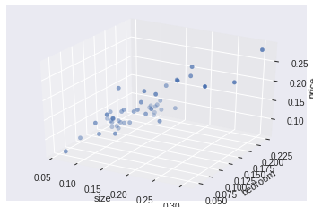
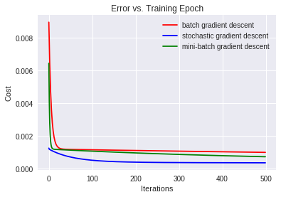
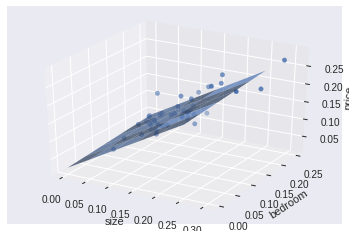
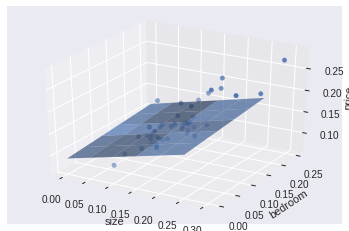

# Predicting-House-Price-using-Multivariate-Linear-Regression
Predicting House Price from Size and Number of Bedrooms using Multivariate Linear Regression in Python from scratch

## Description
This project demonstrates how multivariate linear regression can be used to predict the House Price from Size and Number of Bedrooms.
 
 
A small dataset of house data is utilized. Intuitively, there must be a relationship between the size, number of bedrooms and the price of the house. The more size and number of bedrooms, the more the price of house should be. The multivariate linear regression is used to uncover this relationship.
 
 
There are several numerical optimization techniques amongst which the Gradient Descent method is examined to minimize the cost function of Multivariate Linear Regression.
 
 
There are 3 variants of Gradient Descent algorithm that are implemented and tested throughout the project. 
- Batch Gradient Descent
- Stochastic Gradient Descent
- Mini-Batch Gradient Descent
 
 

### Dataset
- [House Data](https://github.com/kaustubholpadkar/Predicting-House-Price-using-Multivariate-Linear-Regression/blob/master/home.txt)
- Dataset contains 3 columns : size, number of bedrooms	and price comprising of total 47 rows.
- We are using size and number of bedrooms for predicting price of house

### Usage
Run the jupyter notebook `Multivariate_Linear_Regression_Python.ipynb`

### Results

 
 

 
 

 
 

### References
- [Gradient Descent Algorithm and Its Variants](https://towardsdatascience.com/gradient-descent-algorithm-and-its-variants-10f652806a3)
- [Multivariate Linear Regression in Python WITHOUT Scikit-Learn](https://medium.com/we-are-orb/multivariate-linear-regression-in-python-without-scikit-learn-7091b1d45905)
- [Machine Learning Coursera](https://www.coursera.org/learn/machine-learning)
